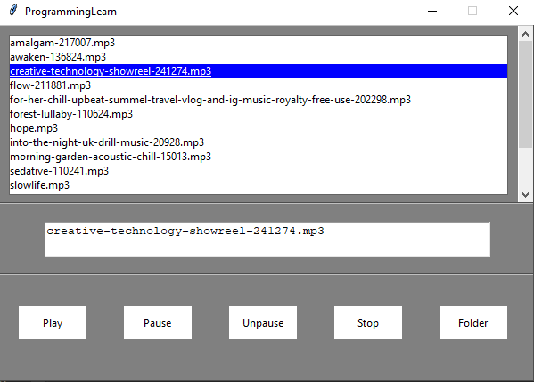

# 🎶 **ProgrammingLearn Music Player** 🎶

A **simple music player** built using **Python** with `tkinter` for the graphical user interface (GUI) and `pygame` for audio playback. This app allows you to play, pause, unpause, stop, and manage a playlist of MP3 files from any folder.

---

## ✨ **Features**

- 🎵 **Play**: Play a selected song from the playlist.
- ⏸️ **Pause**: Pause the currently playing song.
- ▶️ **Unpause**: Resume the song from where it was paused.
- ⏹️ **Stop**: Stop the song and clear the playlist.
- 📂 **Folder Selection**: Browse and select a folder to load MP3 files.
---

## 📸 **Screenshot**

Here’s a screenshot of the **ProgrammingLearn Music Player** in action:



---
## 🎥 **YouTube Tutorial**

If you prefer a video tutorial on how to use the **ProgrammingLearn Music Player**, check out this video on my YouTube channel:

[Watch the tutorial](https://www.youtube.com/watch?v=xXdjZS0pE8c)

You can also follow my channel for more programming tutorials and project walkthroughs.
---
## 🛠️ **Installation & Setup**

### Prerequisites
Ensure you have Python 3.x installed. You'll also need the following Python libraries:

- `pygame` (for audio playback)
- `tkinter` (for the GUI)

### Install Dependencies

You can install the `pygame` and `tkinter` libraries by running the following command:

```bash
pip install pygame
pip install tk
```
### Running the Application

1. **Clone or download** this repository to your local machine.

2. **Run the script**:

```bash
python main.py
```
3. The GUI will appear, allowing you to interact with the music player.

---

## 🎧 **How to Use**

1. **Select Folder**: Use the "Folder" button to browse and select a folder that contains your MP3 files. All MP3 files in the folder will be added to the playlist.
2. **Play Music**: Select a song from the playlist and click the "Play" button to start playback.
3. **Pause**: Click the "Pause" button to pause the song.
4. **Unpause**: Click the "Unpause" button to resume playback from where it was paused.
5. **Stop**: Click the "Stop" button to stop the song and clear the playlist.

---

## 🧑‍💻 **Code Functions**

- `playSong()`: Loads and plays the selected song from the playlist.
- `pauseSong()`: Pauses the current song.
- `unpauseSong()`: Unpauses and resumes playback.
- `stopSong()`: Stops the current song and clears the playlist.
- `selectFolder()`: Opens a folder dialog to select a directory with MP3 files and loads them into the playlist.

---

## 📄 **License**

This project is open-source and available under the [MIT License](LICENSE).

